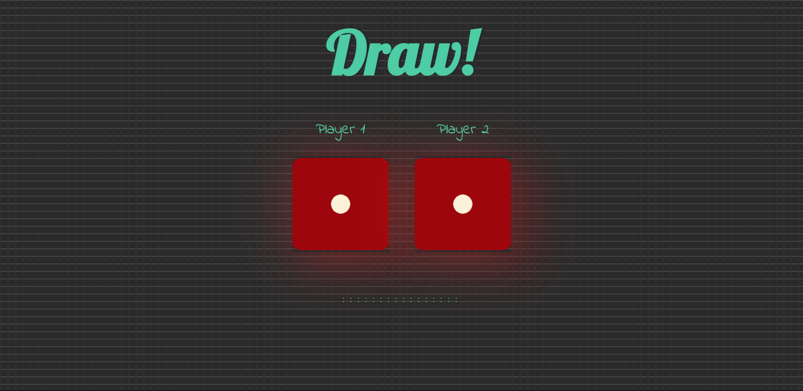

# Dice Challenge Game 🎲
A fun and simple two-player dice game. Refresh the page to roll the dice and see who wins!

## How to Run

1. Download all the files into a single folder:
   - `dicee.html`
   - `styles.css`
   - `index.js`
   - `images/` folder (with dice1.png to dice6.png)
   - `output.png` (optional: for preview)

2. Open `dicee.html` in any web browser.
3. Refresh the page to play the game.

## Output

Below is a sample output of the game:

---

Made for learning and fun!
